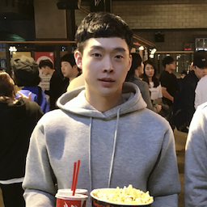

# 유병화 (Alfred, Yoo)

> 본 이력서는 아래 주소에서 최신 업데이트본을 확인 할 수 있습니다:
> https://github.com/b6pzeusbc54tvhw5jgpyw8pwz2x6gs/b6pzeusbc54tvhw5jgpyw8pwz2x6gs/blob/main/RESUME.ko.md

안녕하세요, 2021년 현재 9년차 소프트웨어 엔지니어 유병화 입니다.
웹 프론트 엔드 개발과 백엔드 서버 개발, 서버 운영, Infrastructure as code,
Serverless Architecture, 릴리스 엔지니어링, DevOps 업무 경험이 있습니다.
각 분야에 모두 각기 다른 매력을 느끼며 다양한 업무를 기반으로한 시너지로
높은 퍼포먼스를 만들어 비지니스에 기여합니다.

새로운 언어와 프로그래밍 패턴, 도구 사용법을 익히는데 거부감이 없으며,
스터디 모임에 참가하며 동료들과 함께 성장하는 것을 좋아합니다.
협업하는 상대방을 배려하며 효율적으로 일 할수 있는 환경을 선호하며,
다양한 오픈소스 활동 경험으로 팀원들과 함께 코드 리뷰로 소통하면서
좋은 제품을 만들어가는 문화에 익숙합니다.

## 취미
- 토이 프로젝트 개발, 넷플릭스, 운동, 독서, 카페, 고양이 관찰.

## 학력
- 서울시립대학교 - 컴퓨터 과학 전공 (2004년 3월 ~ 2013년 2월)

## 자격
- 삼성전자 사내 SW Certificate Professional (2021년 9월)
- AWS Certifed Solutions Architect(Associate) (2017년 7월)
- 정보처리 기사 (2011년 7월 24일)

## 경력
- 삼성전자 무선 사업부, 서비스 개발 그룹, 스토어 백엔드 플랫폼 파트 (2021년 3월 ~ )
    - DevOps 방식으로 인프라스트럭처 구축 운영 및 서버 개발.
    - 갤럭시 스토어 백엔드 어드민 서버 개발.
    - 갤럭시 스토어 Open API Service 인증 서버 및 Proxy 기능 개발.
- 삼성전자 무선 사업부, 게임 서비스 그룹, 스토어 플랫폼 파트 (2017년 8월 ~ 2021년 2월)
    - Galaxy Store 마케팅웹 Serverless architecture 설계 및 개발.
    - Galaxy Store API 서버 개발.
    - Big Data 처리를 위한 Scala 배치 프로그램 개발.
    - 게임 런처 GDPR System 인프라 구축 및 개발.
- 삼성전자 무선 사업부, 클라우드 플랫폼 그룹, 앱 스토어 서버 파트 (2014년 12월 ~ 2017년 7월)
    - Galaxy Store 기어 앱 스토어 웹 프론트엔드 개발.
    - Bixby 발화 태깅 툴 개발.
- 삼성전자 미디어 솔루션 센터, Client 개발 그룹 (2013년 4월 ~ 2014년 11월)
    - 타이젠 스마트폰 웹 앱 개발.
    - 타이젠 스마트 워치 웹 앱 개발.
    - 타이젠 TV 웹 앱 개발.
    - Desktop PC 용 웹 앱 개발.
- 삼성전자 무선 사업부, Samsung Linux Platform 개발 그룹 인턴 (2012년 1월 ~ 2012년 2월)
    - 타이젠 스마트폰 애플리케이션 개발.
    - Javascript 개발 스터디 참석.

## 프로젝트

### Galaxy Store 셀러 포탈, 어드민 포탈 (2021년 6월~)
- 소개: Galaxy Store 셀러 포탈은 삼성 전자 Galaxy Store에 앱 등록시 사용하는 사이트이며, 
  어드민 포탈은 앱 검증 및 전시 등 Galaxy Store의 운영을 총괄하는 백 오피스
  사이트.
- 관련 기술: jQuery, AngularJS, JSP, Java, String, Jeus, AWS, Docsify
- 역할:
    - 유지 보수 개발 (기여도 15%)
    - Gradle 적용 및 개발 환경 개선, 빌드 파이프라인 개선 (기여도 90%)
    - AWS 자원을 활용하여 Legacy 시스템 기능 고도화 및 확장 (기여도 90%)

### Galaxy Store API Service (2021년 3월~)
- 소개: 삼성전자 Galaxy Store에 셀러 포탈 사용자가 API로 셀러 포탈의 관련 기능들을
  사용할 수 있게 자동화 할 수 있게 제공해주기위한 API 서비스.
- 관련 기술: Nodejs, React, AWS Lambda, DynamoDB, Kinesis, Terraform,
  AWS ESS, OAuth 방식 인증, JWT
- 역할:
    - DevOps 방식으로 API Service 서버, 웹 클라이언트 설계 (기여도 85%)
    - API Service 서버, 웹 클라이언트 개발 (기여도 40%)
    - API 게이트웨이 역할 서버에 OAuth 인증 모듈 개발 (기여도 50%)
    - Facebook 과 B2B API 연동시 mTLS 인증 모듈 구축 (기여도 100%)

### 게임 런처 GDPR System 인프라 구축 및 개발 (2020년 10월 ~ 12월)
- 소개: 삼성전자 게임 런처 GDPR 처리 시스템.
- 관련 기술: Nodejs, AWS Lambda, DynamoDB, Terraform
- 역할:
    - AWS Lambda, DynamoDB를 사용한 Serverless 아키텍처 설계 (기여도 100%)
    - 필요한 AWS 자원을 Terraform으로 정의 및 구축 (기여도 100%)
    - 시스템 개발 (기여도 80%)
    - 문서화 및 인수인계 (기여도 90%)
- 경험 & 성장한 점:
    - 타 파트 지원 업무. 예상 트래픽을 분석하고 서버리스 아키텍처를 선택,
      AWS 인프라 구축부터 AWS Lambda function 개발하고 문서화하여 인수인계한 작업.
    - 과거 Galaxy Store API GDPR 시스템 구축시의 단점들을 반복하지 않기위해
      설계부터 다시 하여 단점 개선 및 복잡해 질 수 있는 시스템을 단순하게 설계한 경험.

### Big Data 처리를 위한 Scala 배치 개발 (2020년 8월 ~ 9월)
- 소개: 삼성전자 게임 런처의 데이터 처리를 위한 마이크로 서비스.
- 관련 기술: Spark, Scala, Functional Programming, AWS EMR
- 역할:
    - 빅데이터 처리를 위한 전처리 프로그램을 Spark 환경의 Scala 언어로 개발.(기여도 50%)
- 경험 & 성장한 점:
    - 그룹 내 Spark 스터디를 진행하여 Spark 환경에 익숙해진 후 동시에 프로젝트를
      진행하여 새로운 기술을 체계적이고 효율적으로 학습하며 업무한 경험.

### Galaxy Store 마케팅 웹 (2019년 2월 ~ 2019년 8월. 이후 유지보수 중)
- 소개: 삼성전자 갤럭시 스토어의 마케팅 페이지 서버
- 관련 기술: Nodejs, React, SUMO Logic, AWS Lambda, DynamoDB, Kinesis, Terraform
- 역할:
    - AWS Lambda를 사용한 Serverless 아키텍처 설계 (기여도 100%)
    - 마케팅웹 주요 기능인 이메일 템블릿, 브릿지 페이지, 약관 페이지 개발 (기여도 85%)
- 경험 & 성장한 점:
    - 처음으로 인프라스트럭처의 설계, 구축, 관리 롤까지 맡아 진행한 업무.
    - 레거시 프로젝트를 클라우드 자원을 활용하여 전면 개편한 프로젝트로,
      기존 프로젝트 분석, 제안서 작성부터 설계, 개발까지 진행한 경험.
    - 잦은 인프라 변경사항에 유연하게 대처하기위해 Terraform을 사용, 
      Infrastructure as Code 방식으로 인프라를 관리한 경험.
    - CI/CD를 구축, 하루에도 몇번씩 안전하게 운영환경에 배포 가능한 환경을 만듦.
      레거시한 코드 뿐만 아니라 오래된 개발/운영 프로세스도 크게 개선시킨 경험.

### Galaxy Store API 서버 GDPR 처리 시스템 (2017년 8월 ~ 2019월 1월)
- 소개: Galaxy Store API 서버의 GDPR 법률 요청 처리를 위한 시스템.
- 관련 기술: AWS lambda, ECS, ECR, S3, Python, Docker, Terraform, Serverless framework
- 역할:
    - GDPR 시스템 인프라 설계 및 구축 (기여도 70%)
    - AWS Lambda 환경의 Python 프로그램 개발 (기여도 20%)
    - 인프라 배포 및 프로그램의 빌드 파이프라인 구축 (기여도 100%)
- 경험 & 성장한 점:
    - 개발과 운영팀이 나눠져있는 환경에서 개발팀 주도로 Terraform을 사용하여
      운영의 롤을 일부 가져와 업무를 진행하면서 팀간의 업무 프로세스와 롤 정의의
      중요성에 대해 느낌.
    - 요청 처리 상태를 S3에 파일로 관리해서 트랜젝션 처리 및 상태 관리가 어려웠던 경험.

### Galaxy Store API 서버 개발 (2017년 8월 ~ 2019월 1월)
- 소개: 갤럭시 폰에 기본 탑재된 Galaxy Store와 기본 앱 관리를
  지원하기 위한 API 서버.
- 관련 기술: Java, String framework, Gradle, JBoss, Jenkins
- 역할:
    - Galaxy Store API 서버 개발, 이슈 대응 (기여도 15%)
    - 서버 프로젝트 Gradle 적용 (기여도 100%)
- 경험 & 성장한 점:
    - 전세계에 출시된 수억대의 갤럭시 폰을 지원하는 대규모 서버 개발 경험.

### Bixby 발화 태깅 툴 (2016년 10월 ~ 2017년 7월)
- 소개: 삼성전자 Bixby의 머신러닝 학습을 위한 발화 태깅 툴.
- 관련 기술: React, Redux, MUI
- 역할:
    - 웹 클라이언트 아키텍처 설계 (기여도 100%)
    - 웹 클라이언트 개발 (기여도 70%)
- 경험 & 성장한 점:
    - 문장 입력 후 단어 단위로 태깅할 수 있는 고도화된 Web UI 개발 경험.
    - 한국어, 영어 일본어 중국어 스페인어, 독일어 총 6개 언어에 대한
      발화 입력 및 태깅 툴로 전세계 많은 작업자들의 니즈를 해결해주며
      작업 효율을 개선시킨 경험.

### Galaxy Store 기어 앱 스토어 (2014년 12월 ~ 2016년 9월, 이후 유지 보수 중)
- 소개: Galaxy 스마트폰 유저 외 타사 Android 폰과 iPhone 유저들의
  기어 스마트 워치 사용 지원을 위한 웹 기반 기어 앱 스토어.
  83개 언어로 글로벌 총 182개국에 오픈하고, 이후 iOS 지원 업데이트,
  93개국에 유료 결제 지원 업데이트, 디자인 전면 개편 업데이트 등
  대규모 업데이트를 진행.
- 관련 기술: React, Redux, Flux, PG사 연동, Webpack, Babel, CSS-in-JS,
  Storybook,BackboneJS, jQuery, Javascript, HTML5, CSS3, NodeJS, AWS, Docker,
  Gulp, Browserify 등
- 역할:
    - 웹 프론트 엔드 설계, 비지니스 로직, UI 개발, 이슈 대응 (기여도 80%)
    - Bridge를 통한 Native 앱과의 통신 규격 설계 및 개발 (기여도 100%)
    - 80여개의 다국어 지원을 위한 문구 적용 자동화 NodeJS 툴 개발 (기여도 100%)
    - GitLabCI를 통한 빌드 스크립트 작성 및 CI 파이프라인 구축 (기여도 100%)
    - 기술 문서 작성 (기여도 100%)
    - 협업 개발 환경 GitLab, Mattermost 구축 및 운영 (기여도 100%)
    - 1차 출시 이후 Flux 도입, React,Redux 도입 등 코드 레벨의 대규모
      리팩토링 작업 수행. (기여도 80%)
    - Webpack, Babel 등 웹 프로젝트 빌드, CI 업데이트 (기여도 100%)
    - Linaria 적용 및 Storybook 개발 환경 도입 (기여도 100%)
- 경험 & 성장한 점:
    - 83개 언어로 182개국에 1차 글로벌 오픈.
    - 1차 출시 이후 iOS 지원 및 93개국에 유료 결제 지원, 디자인 리뉴얼 등
      대규모 업데이트 작업 경험.
    - 형상 관리 툴로 SVN과 P4를 사용하며, E-mail로 커뮤니케이션하는 기존
      개발 환경을 개선하기위해 AWS 자원을 사용하여 직접 GitLab, Mattermost를
      구축 운영하며 AWS, Docker 등 많은 Cloud 플랫폼을 경험함.
    - 개발 환경 효율화 덕분에 적기에 글로벌 출시를 할 수 있었고,
      이후 대규모 작업도 순조롭게 진행하며 개발 환경의 중요성을 느낌.
    - Storybook 도입으로 UI와 비지니스 로직 개발 부서간 분업 효율을 개선시킨 경험.

### Milk 개발 Web, Tizen TV, 기어 S 버전 (2014년 5월 ~ 2014년 10월)
- 소개: 삼성전자의 Music 스트리밍 서비스.
- 관련 기술: Javascript, HTML5, Ajax, CSS Transform
- 역할:
    - 음악이 변경될 때 트랜지션 효과 구현 및 최적화 (기여도 100%)
    - (TV 버전) 키보드, 마우스없이 리모컨트롤러로 모든 앱 기능을 활용할 수 있게
      도와주는 포커스 매니저 기능 개발. (기여도 100%)
    - (기어 S 버전) 휠을 돌리면서 음악을 선택할 수 있는 UI 개발. (기여도 90%)
- 경험 & 성장한 점:
    - Javascript Mouse event를 통해 x,y 좌표값을 받아 기준점과의 각도를 계산,
      마치 휠을 회전시키는 느낌을 주며 음악을 선택하는 고도화된 UI 개발 경험.

### WatchOn Remote 개발 (2013년 7월 ~ 2014년 3월)
- 소개: 삼성 스마트 워치 [Gear2](https://ko.wikipedia.org/wiki/삼성_기어_2)에 기본 탑재 되는 WatchOn Remote 앱.
  적외선 센서로 TV, 셋탑박스, 에어콘 등 전세계 거의 모든 장비를 컨트롤 할 수 있는 앱.
  2014년 3월에 글로벌 출시된 Gear2에 기본 탑재 앱.
- 관련 기술: Javascript, HTML5, CSS3, [Critical rendering path](https://developers.google.com/web/fundamentals/performance/critical-rendering-path)) 최적화.
- 역할:
    - 웹 프론트 앱 설계, 비지니스 로직, UI 개발. (기여도 90%)
    - 전세계 제조사의 다양한 장비와 호환 가능한 앱 개발을 위해
      리모컨 적외선 신호를 관리하는 협력 업체와 함께 이슈 대응. (기여도 20%)
    - 저사양 장비에서 웹 앱이 Native 앱 만큼의 성능을 내기 위한 최적화. (기여도 100%)
- 경험 & 성장한 점:
    - 삼성 전자 플래그쉽 제품의 대량 생산 프로세스에 맞춘 강도 높은 검증을 통과하기 위해
      기획, 디자인, 개발, 검증, 협력업체 등의 유관 부서와 긴밀하고 신속하게 협업한 경험.
    - 전세계 약 80개국어를 지원하는 앱을 개발하며 다국어 이슈를 해결한 겅험. 수 많은
      다국어 UI 이슈를 빠르게 해결할 수 있는 디버깅 노하우.

### ePub Viewer 개발 (2013년 4월 ~ 2013년 6월)
- 소개: 타이젠 스마트폰에 탑재될 ePub Viewer.
- 관련 기술: TizenOS WebView, Javascript, HTML5, CSS3
- 역할: 기술 검토 및 프로토 타입 개발 (기여도: 100%)
- 경험 & 성장한 점:
    - 웹에서 나인 패치 이미지를 활용하는 노하우.
    - 밑줄 긋는 효과를 위해 HTML Element의 Text select, range API 사용 경험.

## 오픈 소스 개발

### Visualized sort algorithm (2019년 12월 ~ 2020년 5월)
- 소개:
    - 개인 오픈소스 Toy 프로젝트: https://vsa.aluc.io/
    - React, Nextjs 애플리케이션 셋업, 구현, 배포 전 과정을 진행하고,
      그 과정을 설명한 영상을 [유튜브 채널](https://www.youtube.com/watch?v=5SNn82PVGlc&list=PLGdiwDtJBQmdt8YWnH5UixRqsO4PQqn60)에 업로드한 프로젝트.
- 관련 기술: Nextjs, React, Hooks, Sort Algorithm, Element transition, Vercel
- 역할: 예제 프로젝트 개발 및 유튜브 영상 제작 (기여도 100%)
- 경험 & 성장한 점:
    - 이해하고 사용하는 것과 설명하는 것에는 큰 차이가 있다는 것을 알게됨.
    - 설명을 다듬으면서 더 깊고 넓게 이해를 확장시킨 경험.

### Pretty text generator (2019년 11월. 이후 유지 보수 중)
- 소개:
    - 개인 Toy 프로젝트: https://github.com/aluc-io/pretty-text-generator
    - Live: https://pt.aluc.io/
    - 512x512 사이즈의 멋진 텍스트 프로필을 만들어주는 툴.
      슬랙 봇이나 GitHub 봇 등의 프로필 이미지를 등록할 때 쓰려고 만들었는데
      사진을 등록하기 수줍어하는 사람 친구들도 많이 사용해서 뿌듯했었음. 
- 관련 기술: Pixijs, HTML5 Canvas, React(Hooks), Redux, ZEIT(Vercel), MUI
- 역할: 기획, 개발, 운영 모든 부분을 100% 기여.
- 경험 & 성장한 점:
    - PixiJS를 통해 HTML5 Canvas 개발 및 디버깅 경험.

### Show me the video (2019년 2월)
- 소개:
    - 개인 Toy 프로젝트: https://github.com/aluc-io/show-me-the-video
    - Live: https://show-me-the-video.herokuapp.com/
    - 유튜브를 사용할 수 없는 환경에서 영상을 효과적으로
      공유하기위한 "Mini Youtube as code" 프로젝트.
    - Markdown 파일에 영상의 url과 영상 설명을 작성하면,
      영상 목록 페이지와 디테일 페이지를 제공해주는 사이트.
- 관련 기술: Nextjs, Heroku, git, 반응형 UI(CSS flex, grid-template)
- 역할: 기획, 개발, 운영 모든 부분을 100% 기여.
- 경험 & 성장한 점:
    - 최신 웹 UI 기술 스택인 Material-UI, styled-components 등을 사용한 반응형 UI 개발 경험.

### react-utterances (2018년 9월)
- 소개:
    - 개인 Toy 프로젝트: https://github.com/b6pzeusbc54tvhw5jgpyw8pwz2x6gs/react-utterances
    - Live: https://kwk5x0nyr7.codesandbox.io/my-first-post
    - GitHub 이슈 기능을 활용한 댓글 위젯 [utterances](https://utteranc.es/)의 React Component.
- 관련 기술: React, Lerna, NPM, CircleCI, GitHub App
- 역할: 기획, 개발, 운영 모든 부분을 100% 기여.
- 경험 & 성장한 점:
    - NPM으로 배포되는 React Component 개발 경험.
    - 모노레포 관리 경험.

### dnsever-ddns-updater (2016년 1월)
- 소개:
    - 개인 Toy 프로젝트: https://github.com/b6pzeusbc54tvhw5jgpyw8pwz2x6gs/dnsever-ddns-updater
    - dnsever.com 서비스 유저를 위한 IP 변경에 따른 DNS Record 자동 업데이트 프로그램.
    - dnsever.com 에서 공지로 프로그램이 소개되고, 주간 다운로드 수 최고 670건 기록.
- 관련 기술: Nodejs, PM2
- 역할: 기획, 개발, 운영 모든 부분을 100% 기여.
- 경험 & 성장한 점:
    - 서버에서 실행되는 Nodejs 프로그램 개발 밈 PM2 기반의 Nodejs 프로세스 관리 경험.

### request-animation-frame-polyfill (2016년 4월 ~ 이후 유지 보수 중)
- 소개:
    - 개인 오픈소스 Toy 프로젝트: https://github.com/aluc-io/request-animation-frame-polyfill
    - NPM Weekly Downloads: 2,536
    - `window.requestAnimationFrame` API를 직접 setTimeout으로 구현,
      해당 API가 미구현된 구버전 브라우저나 Nodejs 환경에서 에러를 방지하고
      동작 가능하게 만들어주는 Javascript 패키지.
- 관련 기술: `window.requestAnimationFrame`, NPM, rollup, babel
- 역할: 기획, 개발, 운영 모든 부분을 100% 기여.
- 경험 & 성장한 점:
    - NPM 에 publish 한 뒤 얼마 후 확인 하였을 때 사용자가 생각보다 많아
      오픈 소스 유지 보수에 책임감이 생겼던 경험.

### tweening-js (2016년 1월 ~ 이후 유지 보수 중)
- 소개:
    - 개인 오픈소스 Toy 프로젝트: https://github.com/aluc-io/tweening-js
    - 웹 프레임워크에 종속 없는 트랜지션 애니메이션 구현을 도와주는 라이브러리.
- 관련 기술: Web, requestAnimationFrame, Easing functions, jest, coveralls, CirlcCI, NPM
- 역할: 프로젝트 설계 및 개발, 문서화 (기여도 100%)
- 경험 & 성장한 점:
    - 웹에서 간단한 Element 트랜지션 애니메이션 효과를 구현하기위해
      기능이 많은 무거운 라이브러리를 임포트하는것이 부담되어 개발한
      오픈소스 라이브러리.
    - 여러 웹 프레임워크에서 제공해주는 방법과 전문 패키지들의 대한 선호로
      잘 사용하지는 않게됨. 하지만 프레임워크의 종속 없이 가볍게
      트랜지션 효과만을 구현하려고 할 때 여전히 사용하고있음.
    - 초기에 TravisCI 사용 후 지금은 CircleCI로 전환, 여러 CI 서비스를 경험.

## 오픈 소스 기여

- Terraform Next.js module for AWS
    - https://github.com/milliHQ/terraform-aws-next-js/pull/211
    - https://github.com/milliHQ/terraform-aws-next-js/pull/208
    - https://github.com/milliHQ/terraform-aws-next-js/pull/206
    - https://github.com/milliHQ/terraform-aws-next-js/pull/192
    - https://github.com/milliHQ/terraform-aws-next-js/pull/187
    - https://github.com/milliHQ/terraform-aws-next-js/pull/185
- Terraform Next.js Image Optimization module for AWS
    - https://github.com/milliHQ/terraform-aws-next-js-image-optimization/pull/13
- Carbon
    - Contributor
    - https://github.com/carbon-app/carbon/pull/949
- Gastby 문서 한글화
    - https://github.com/gatsbyjs/gatsby-ko/pull/18
    - https://github.com/gatsbyjs/gatsby-ko/pull/7
    - https://github.com/gatsbyjs/gatsby-ko/pull/3
- Atom Editor
    - https://github.com/atom/atom/pull/10967
- CSS-in-JS Babel Plugin
    - https://github.com/martinandert/babel-plugin-css-in-js/pull/15
- Babel plugin handbook 한글 번역
    - https://crowdin.com/project/babel-plugin-handbook/ko#/master
    - https://github.com/jamiebuilds/babel-handbook/tree/master/translations/ko
- 구름입력기 (Financial contributor)
    - https://github.com/gureum/gureum/issues/535
    - https://github.com/gureum/gureum/issues/515
- reduxjs/reselect
    - https://github.com/reduxjs/reselect/pull/210

## 그 외 활동

### SW 개발 주제로 Youtube 채널 운영
- 커밋한잔 유튜브 채널 운영: https://www.youtube.com/c/ACupofCommit

### 사내 그룹 React 세미나 강사 (2021년 4월)
- 온/오프라인으로 매회 50분 강의 총 13회. 커리큘럼:
    1. 소개, npm, create-react-app, hello world AWS 배포, 사내 React 개발 환경 가이드
    2. jsx, 컴포넌트, props, state, lifecycle methods
    3. map() 반복문, 이벤트 처리
    4. Styling, semantic-ui, material-ui
    5. 서버 API 사용, callback, promise, async/await
    6. Hooks (1/2)
    7. Hooks (2/2)
    8. State management (redux, zustand, recoil 등)
    9. 미니 프로젝트에 Hooks, state management 적용
    10. Jest unit test, Storybook
    11. (Nextjs) 소개, create-next-app, typescript 적용, 페이지 레이아웃, Dynamic Routes, hello world AWS 배포.
    12. (Nextjs) SSR, Automatic Static Optimization, getInitialProps, getServerSideProps, ... , `_app`, `_document`
    13. (Nextjs) 에러페이지, 환경 변수, Dynamic import

### 발표 자료 - CircleCI vs GitLabCI slide (2020년 1월~)
- https://aluc.io/slide/gitlabci-vs-circleci/index.html#1

### 스터디 - Spark with Python (2020년 7월~)
- https://www.notion.so/Spark-with-Python-dea87f17d10c4d4cae446eda659284ae

### 스터디 - 쿠버네티스 패턴 (2020년 5월~)
- https://www.notion.so/44bits/2020-05-901158ed776547d8bac0c6bf6145ea64

### 스터디 - 마이크로서비스 아키텍처 (2020년 3월~)
- https://www.notion.so/44bits/2020-03-b4eaa426d275428a820e98ed74849da6

### 스터디 - 시스템 성능 분석과 최적화 (2020년 1월~)
- https://www.notion.so/44bits/2020-01-8fe073a736bd4cbfa7a937a4f088a0c2

### 스터디 - 사이트 신뢰성 엔지니어링 (2019년 2월~)
- https://www.notion.so/44bits/2019-01-72d942e3a446445a8a696c209f2db3fb

### 스터디 - 클라우드 네이티브 인프라스트럭처 (2019년 1월~)
- https://www.notion.so/44bits/2019-01-72d942e3a446445a8a696c209f2db3fb

### 스터디 - CNCF(Cloud Native Computing Foundation) 프로젝트 리서치 (2019 1월~)
- https://www.notion.so/44bits/2019-01-72d942e3a446445a8a696c209f2db3fb

### 발표 자료 - Docker & DevOps slide (2018년 9월)
- https://aluc.io/slide/docker-devops/index.html#1

### 스터디 - Microservice x Kubernetes (feat. CNCF) (2018년 1월~)
- https://paper.dropbox.com/folder/show/microservice-x-kubernetes-study-e.iX7ZavGxujPFwhjOZcQqx0sPS7rxiwoMsezLUMQI62EoPiAheQ

### 사내 팀 신입 사원 서버 개발 업무 교육 강사 (2017년 11월~)
- AWS, Spring, Nodejs, Web, Git, Docker, Terraform, Proxy 주제로 교육

### 스터디 - The Twelve-Factor App (2017년 8월)
- https://12factor.net/
- https://the-twelve-factor-app.herokuapp.com/

### 스터디 - TCP/IP 쉽게 더 쉽게 (2017년 7월~)
- https://paper.dropbox.com/folder/show/study-tcp-ip-e.iX7ZavGxujPFwhjOZcQsjuD1XUL9krjtq4hL1fWQQ03qTtgcQI

### 스터디 - Infrastructure as Code (2017년 6월~)
- https://paper.dropbox.com/folder/show/Infrastructure-as-Code-e.iX7ZavGxujPFwhjOZcQs9GyWabf3rfttGfyIz3HxguZl4pJBKd

### Open Container Seoul Metetup 발표 - BLUE-GREEN deployment (2016년 11월)
- https://www.youtube.com/watch?v=4rioK4taRzk
- https://www.slideshare.net/AlfredUC/bluegreen-deployment-with-nginx

<!--
## References
- https://github.com/thumbsu/resume
- https://github.com/asbubam/resume
- https://github.com/JSpiner/RESUME
-->
